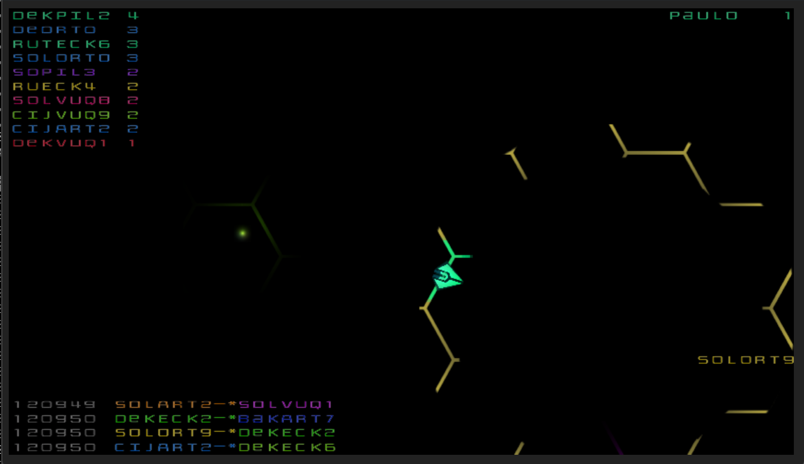

# HEXOIDS

A simple distributed arcade game.

- [Playing the Game](#playing-the-game)
- [Requirements](#requirements)
- [Development](#development)
    - [Infrastructure](#infrastructure)
    - [Start Quarkus](#start-quarkus)
- [Production](#production)
    - [Setup Env](#setup-env)
    - [Cluster Commands](#cluster-commands)
- [Bots](#bots)
- [Architecture](#architecture)
- [Future Improvements](#future-improvements)
    - [Technical](#technical)
    - [Game Play](#game-play)
    
# Playing the Game

The game is best played with a trackpad. 

* Press `C` to fire
* Keep `Z` pressed to lock aim direction
* Keep `X` pressed to lock position and aim freely.
* Press `W` to aim towards forward direction.
* Press `D` to aim 90&deg; clockwise from forward direction.
* Press `S` to aim 180&deg; from forward direction.
* Press `A` to aim 90&deg; anticlockwise from forward direction.

# Requirements

* [Java 8](https://openjdk.java.net/install/)
    * [Maven](https://maven.apache.org/)
* [Docker](https://www.docker.com/)
    * [docker-compose](https://docs.docker.com/compose/)
* WebGL capable Browser

# Development

## Infrastructure

Hexoids uses [Apache Kafka](https://kafka.apache.org/) as its backend

To start infrastructure services run:

    docker-compose -f docker-compose-dev-infrastructure.yml up -d
    
If you'd like to reset the backend run:

    docker-compose -f docker-compose-dev-infrastructure.yml rm -svf

You will have to append the following to your `/etc/hosts` file:

    127.0.0.1 hexoids-kafka

## Start Quarkus

Hexoids is built using [Quarkus](https://quarkus.io/)

To start the service run:

    ./mvnw compile quarkus:dev
    
and open in a WebGL capable browser:

    http://localhost:8080
    
If you wish to use a different port run:

    ./mvnw compile quarkus:dev -Dquarkus.http.port=8180
    
# Production

The file `docker-compose.yml` is a guide on how we could setup Hexoids for production.
This particular setup runs everything in a single Host which is not something you'd
do for real. Regardless this allows us to test the service in a distributed fashion.

> **IMPORTANT**: If running on multiple host their clocks must be synchronized.

# Bots

Bots can be simulated in the folder [bots](/bots).

## Setup ENV

Copy `.env.sample` to `.env` and replace the value
`HEXOIDS_HOST` with your accessible host hostname or ip. The server will be
accessible on the hostname/ip on port 80: `http://HEXOIDS_HOST`.

## Cluster commands

| Action | Command |
| --- | --- |
| Start | `docker-compose up -d` |
| Stop | `docker-compose stop` |
| Log | `docker-compose logs -f hexoids` |
| Scale | `docker-compose scale hexoids=2` |
| Delete | `docker-compose rm -svf` |

# Architecture

Hexoids is server authoritative and is built around an event driven model.
It uses Apache Kafka to coordinate between servers nodes, WebGL via Phaser 3 on the client side and
WebSockets for client server communication.

Kafka isn't always the best choice for low latency but it has some interesting properties that
were exploited here. Primarily, a node can be started and quickly get caught up to speed by replaying
compacted logs. In other words the state can be retrieved by replaying all events.

A client request will reach its node which will enqueue some action onto the game model. The game model
will act upon it and fire a domain event onto Kafka which will the spread that to all nodes. The nodes
will interpret those domain event and broadcast the corresponding dto to the clients. All domain events and dtos
are represented in Protobuf.

Bolt logic is handled by a special kind node that doesn't need to be directly available to clients. These nodes
are responsible for moving the bolt and checking if they are a hit.

Ships move with inertia. Player add vectors to their current vectors through the trackpad or mouse. The node 
that the player is connected to is responsible for calculating the inertial movement of the ship. 
This is all done with basic vector math.

# Future Improvements

## Technical

* Lag compensation on the client side.

    Right now there is no lag compensation on the client.
    Users behind high latency connections would have a poor experience.
    
* Move to more robust client side framework like [Godot](https://godotengine.org/).

    [Phaser](https://phaser.io/) is a great way to get started and prototyping
    quickly. But from a scalability stand point there's only so far you can go
    running the client on a single threaded browser engine.

* Replace WebSockets with a combination of TCP an UDP sockets.

   TCP connections are expensive, WebSockets even more so. High frequency events 
   like player and bolt movements would be better served over a UDP socket. 

* Add persistence

    Right now nothing gets persisted long term. It would be interesting to
    persist certain player information like K/D and Hit miss ratio's. As well as a permanent
    leader board. For this to work properly though we would need authentication.

* Look into migrating the Kafka client to reactive streams

    This promises to reduce the code base.
    
* Use a spatial index on the server.

    Right now all events are broadcasted to all players. That might not always be necessary. Also,
    Bolt collision is tested against all players when it should look up players in a spatial index first.

## Game Play

* Add obstacles

    Without any kind of obstacles the game quickly becomes a frenetic death match
    with bolts flying all over the place. Having obstacles would allow players to
    employ diverse tactics. This could be done procedurally. It would event be 
    interesting to allow players to deploy obstacles in a limited fashion.
   
* Power Ups

    Having players compete to acquire power ups would add variety to the game:
    teleport, cloak, bombs, shields, faster bolts, more bolts, etc.
    
* Different ships
    
    Give players the option to choose different ships with different properties:
    More bolts, faster top speed, faster acceleration, etc.
    
* Teams and different game modes

    With teams there could be different game modes like capture the flag and
    elimination.
    
# CREDIT

The code was originally created by Paulo Casaes. The name was given by [Lucio Paiva](https://github.com/luciopaiva).
[João Pereira](https://github.com/jpereiramp) acted as a springboard for ideas.